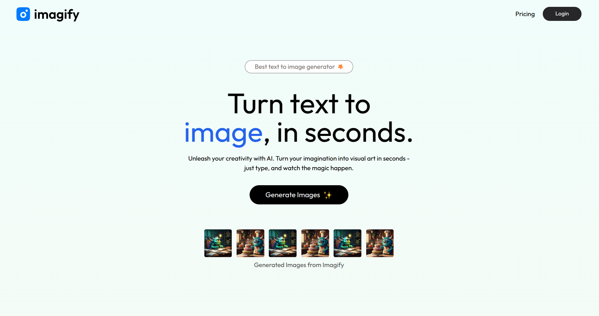

# Imagify (AI-Powered Text-to-Image SaaS)

This is the frontend of a full-stack **AI-powered text-to-image generator SaaS application** built using **React.js** and **Tailwind CSS**. The application allows users to generate AI images using text prompts, manage credits, and make payments.

## 📷 Preview

## 🌍 Live Demo  

🔗 **Live Link:** [Click Here](https://imagify-ai-saas.vercel.app/)  

🔗 **Backend Repository:** [Backend repo](https://github.com/sudo-dpkg/imagify-backend)  

## 🚀 Features

- 🔐 **User Authentication** - Sign up, login, and session management.
- 🎨 **AI Image Generation** - Convert text prompts into AI-generated images.
- 💳 **Credit-based System** - Users can purchase credits to generate images.
- 🏷 **Payment Integration** - Seamless Razorpay payment processing.
- 📥 **Image Download** - Users can download AI-generated images.
- 🎭 **Dynamic UI with Animations** - Built with Tailwind CSS for responsiveness.

## 🛠️ Tech Stack

- **React.js** - Frontend framework
- **Tailwind CSS** - Styling and responsive UI
- **React Router** - Navigation handling
- **Axios** - API calls
- **Razorpay SDK** - Payment gateway integration
